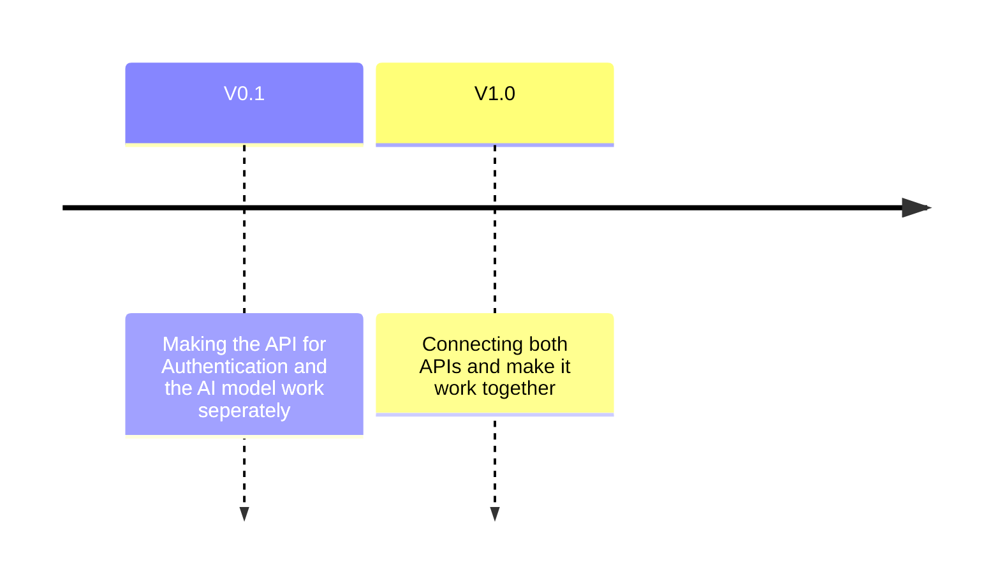

# **🚀 AI-API**  
A sample API project for **interacting with a local model** 🧠, **managing models** 🔄, and **handling authorization** 🔐.  

---

## **📌 Summary**  
This project provides an API for **efficient AI model interaction**, including:  
✔ **Model execution & inference** 🏎️  
✔ **Model management & updates** 🔄  
✔ **User authentication & authorization** 🔐  
✔ **Optimized local AI processing** 💻  

Designed for **flexibility and scalability**, this API enables **seamless integration** with local AI models.  

---

## **🛠️ Roadmap**  



---
# 🚀 **Quick Vulture Guide**  

Vulture helps detect unused Python code. Here's a quick overview to get you started!  

- 🔍 **Basic Scan:**  
  ```bash
  vulture myscript.py
  ```
  Or as a Python module:  
  ```bash
  python3 -m vulture myscript.py
  ```

- 📂 **Scan Multiple Files:**  
  ```bash
  vulture myscript.py mypackage/
  ```

- 🎯 **Only 100% Dead Code:**  
  ```bash
  vulture myscript.py --min-confidence 100
  ```

- 📝 **Generate Whitelist:**  
  ```bash
  vulture mydir --make-whitelist > whitelist.py
  ```
  
This quick guide keeps your Python projects clean and efficient! 🚀
---

## **📦 Prerequisites**  
### **1️⃣ Clone the Repository**  
```bash
git clone https://github.com/tomdevtech/AI-API
cd AI-API
```

### **2️⃣ Install Ollama**  
🔗 [Download Ollama](https://ollama.com/download) and install it on your system.  

📌 **No need to manually download the model!** 🧠  
The code automatically downloads it when needed. 🚀  

### **3️⃣ Install Required Python Libraries**  
Run the following command to install all dependencies:  
```bash
pip install -r requirements.txt
```

Or install them manually:  
```bash
pip install [libraries]
```

Execute the main.py file and have fun with interacting with the model! 🔥

### **5️⃣ Success! 🎉**  
✅ The chatbot is now up and running and you can login via API!  
🎯 Experiment with different models and explore all features.  

---

## **📚 References & Further Reading**  
📹  [Inspiration Tech With Tim Video](https://youtu.be/cy6EAp4iNN4?feature=shared)<br>
👾  [Inspiration Tech With Tim Code](https://github.com/techwithtim/API-For-Your-LLM/tree/main)<br>
🔐  [Inspiration Tech With Tim Authentification](https://github.com/techwithtim/Fast-API-Tutorial)<br>
📖  [Markdown Syntax Guide](https://docs.github.com/en/get-started/writing-on-github/working-with-advanced-formatting)  
📖  [About READMEs – GitHub Docs](https://docs.github.com/en/repositories/managing-your-repositorys-settings-and-features/customizing-your-repository/about-readmes#about-readmes)  
⚙️  [CI/CD Pipelines – Overview](https://www.atlassian.com/continuous-delivery/ci-vs-ci-vs-cd)  
💡  [Ollama Documentation](https://ollama.com/docs)<br>
💡  [Ollama API Documentation](https://github.com/ollama/ollama/blob/main/docs/api.md)<br>
💡  [Ollama REST API Postman Collection](https://www.postman.com/postman-student-programs/ollama-api/overview)<br>
🧠  [LangChain Docs](https://python.langchain.com/)<br>
📃  [GitHub Code Workspaces](https://code.visualstudio.com/docs/editor/workspaces/workspaces)<br>
📃  [Vulture Documentation](https://github.com/jendrikseipp/vulture)<br>
